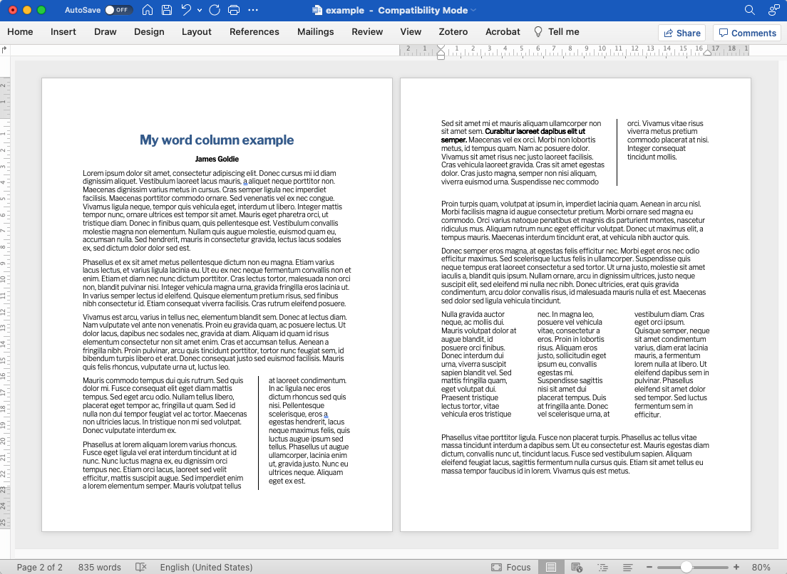

[Find this at github.com](https://github.com/jimjam-slam/columnflow){.btn .btn-gradient}

Column is a [Pandoc filter](https://pandoc.org/lua-filters.html) (packaged as a [Quarto](https://quarto.org) extension) that adds flowing multi-column sections to Word documents.

Although Quarto has a variety of layout options that work with Word documents, none of them will "reflow" inline content across columns the way native Word columns will. This extension turns fenced divs marked with the `.columnflow` class into mutli-column sections.

These sections can be configured to have any number of columns of equal or unequal widths, and spacing can be configured too.

Because it's a Pandoc filter, columnflow can be used by other Pandoc-based tools, like RMarkdown.
