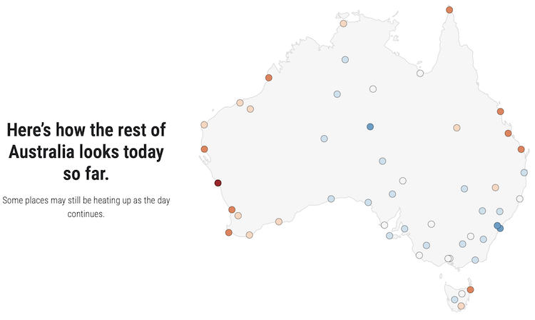

[Find this at isithotrightnow.com](https://isithotrightnow.com){.btn .btn-gradient}

Sometimes you just need a simple answer to a (not-so-)simple question: is it hot right wow?

Mat Lipson, Stefan Contractor and I cobbled the basic concept for this over a few weekends in late 2017. After running for seven years, we decided to give it a major rework, expanding from 9 stations across Australia to over 50, adding an interactive map and a search function, as well as improving the graphics.

The backend was also completely rebuilt and shifted to AWS Lambda to make it cheaper, more scalable and better documented.

