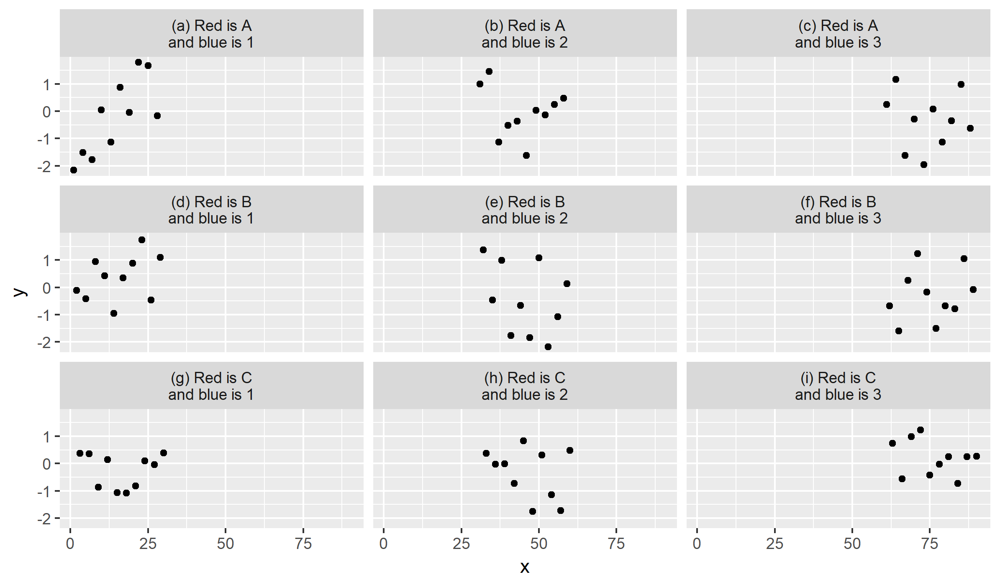

The [`stickylabeller`](https://github.com/jimjam-slam/stickylabeller) package helps you label the facets in your ggplot2 plots. If you know how to use the [`glue`](https://cran.r-project.org/web/packages/glue/index.html) package, you know how to use `stickylabeller`! Some stand-out features include the ability to automatically number/letter your facets for use in papers and reports, as well as the ability to easily include summary statistics in your facet labels.

You can install `stickylabeller`, learn how to use it and file any issues you have with it [on GitHub](https://github.com/jimjam-slam/stickylabeller)!
