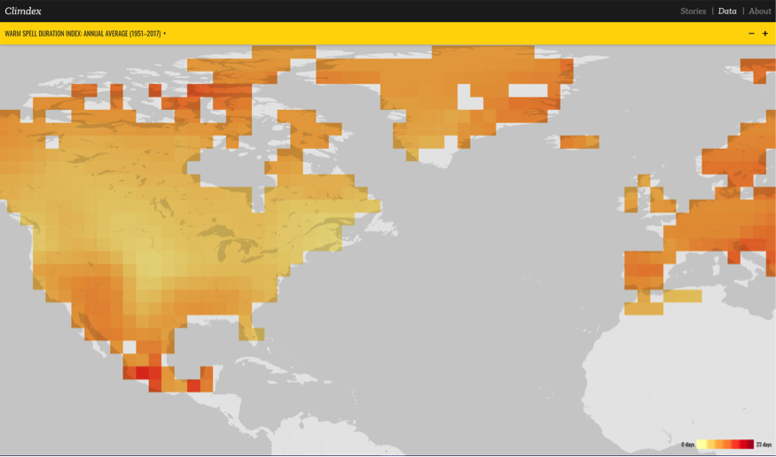

_**Note:** this project has now been retired._

I produced two websites for the recent ARCCSS Showcase. One of those was [Explore Climdex](https://exploreclimdex.org), a site designed to allow people to either explore our massive datasets of climate extremes on their own or to be walked through interesting aspects of extremes research in a guided way.

Explore Climdex had two modes. The first was a classic data portal, where users could select one of the indices quantifying an aspect of changing  climate extremes, such as the temperatur3 of the hottest day every year, and view a map of it.

The other mode told stories to highlight promising new climate research using some of the most interesting aspects of the data. These guided stories combined changing map layers with text and graphics. Example stories that I built for the showcase included:

* A story explaining how the shrinking difference between nights and days was a fingerprint of climate change;
* A story showing that rainfall extremes were changing in different ways in wet and dry parts of the world; and
* The twin challenges of rising heat and urbanisation in south-east Asia.

I've written about [some of the design decisions](http://climateextremes.org.au/arccss-showcase-projects/) behind this project, as well as [some of the technical challenges](https://medium.com/@jamesgoldie/challenges-visualising-climate-extremes-with-leaflet-7a407162d75f).

A lot of the ideas from this website (if not the underlying technology) were incorporated into a new version of [climdex.org](https://climdex.org).
