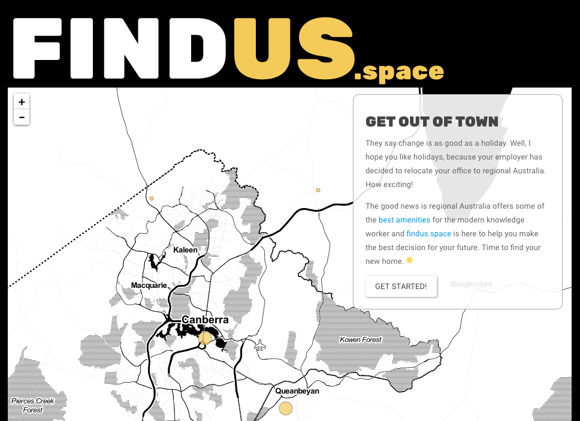

_**Note:** this project is no longer hosted, but it is still on [GitHub](https://github.com/teamsuperduper/findus_space)._

I built Findus.space with four others as part of a team of four for GovHack 2017. The idea was to help a fictional government agency relocate to regional Australia, using a range of evidence-based (and not-so-evidence-based) predictors.



If you have R, you can also run Findus.Space locally! You'll need the [`tidyverse`](https://cran.r-project.org/package=tidyverse), [`shiny`](https://cran.r-project.org/package=shiny) and [`leaflet`](https://cran.r-project.org/package=leaflet) packages. Then:

```r
shiny::runGitHub('findus_space', 'teamsuperduper')
```

Enjoy!