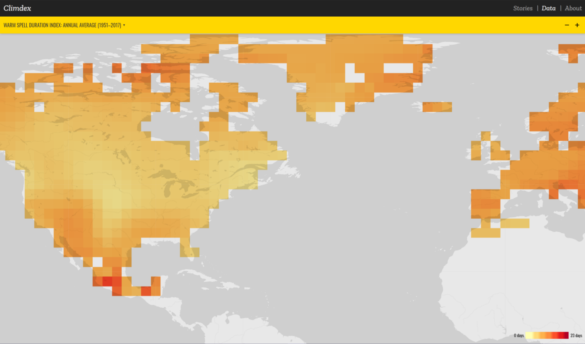

Climate extremes are a really compelling area for data visualisation. There are massive amounts of data, and the impacts hit everything, from food production to keeping infrastructure going to… y’know, _living_. I was recently invited to create a pair of visualisations of climate extremes for [my centre’s](http://climatescience.org.au) showcase. They are:

* [The Heartbeat of Australian Extremes](/projects/heartbeat), and
* [Explore Climdex](/projects/explore-climdex).

These visualisations were built with [Leaflet.js](https://leafletjs.com), which I was largely new to. I ended up learning a boatload about delivering useful on-demand visuals from large datasets, so I’m gonna share three tricks I picked up working with Leaflet, [Geoserver](https://geoserver.com) and R!

## Delivering map tiles with Geoserver

I usually like to build visualisations that can be statically deployed on a host like GitHub Pages or Netlify. That’s mostly because I often build visuals to be picked up by media outlets or social media, and those sorts of things might be served up ten or a hundred thousand times in a week before winding down to zero. It’s nice not to have to worry about the server costs if something proves unexpectedly popular.

Some kinds of scientific data work well with a static host. You could, for example, turn points, lines or shapes from a GIS program into a plain-text GeoJSON file and host them with a Leaflet map as easily as an image.

But you can’t serve everything up on a static host, and massive climate datasets definitely aren’t a good fit. The climate data in these projects was gridded, meaning it exists as a cube of data across the globe (and across time, in this case). Weighing in at a few hundred megabytes for just one observational dataset, it would make GitHub very unhappy. It also exists in a file format, beloved by climate scientists but largely unknown to everyone else, called NetCDF. It’d take a lot of pre-processing to get it into a format that Leaflet is happy with.

Enter [GeoServer](http://geoserver.org). Just as web server software listens for page requests from people and serves them up web pages, GeoServer listens for requests for geospatial data from people (or, perhaps more typically, from apps and sites that people use), processes it and serves it up.

GeoServer can swallow most kinds of geospatial data — including NetCDFs — whole and spit it out as map tiles (or just massive untiled images, if that’s what you need). Leaflet can then request a layer, a region and a time and get the tiles it needs, as it needs them. Using GeoServer meant that I could use our observational data very nearly as-is; all I had to was set up the styling and worry about building the client-side experience.

## Interactive plots from ggplot: using `{gridSVG}`

In another blog post, I discussed our decision to pair the animated map in the [heartbeat visualisation](/projects/heartbeat) visualisation with a bar chart. I’m already very comfortable with ggplot2, and in the past, I would’ve used one of the R packages designed to wrap a JavaScript plotting library, like [`{plotly}` for R](https://plot.ly/ggplot2) or [`{highcharter}`](http://jkunst.com/highcharter), to produce an interactive plot. But this wasn’t a standalone chart: I needed it to stay synced to the Leaflet map, and I wasn’t super comfortable that the limited interactivity of crosstalk could keep them together that way (especially when I was using [a Leaflet plugin](https://github.com/socib/Leaflet.TimeDimension) to the animation work). Nor was I confident that I’d be able to find my way around the resulting plots well enough to figure out where to hook them into the map.

, and I overrode its update method to also animate the chart.](heartbeat.gif)

The other option that datavis folks usually go for is building a bespoke chart using [d3.js](https://d3js.org). I was about a chapter-and-a-half into a d3 book when I started this project, and, as experts have previously mentioned, [d3 is massive](https://medium.com/@Elijah_Meeks/d3-is-not-a-data-visualization-library-67ba549e8520). What I wanted was a solution that would let me:

* Use my existing ggplot2 skills to build and style a plot quickly, without worrying about trying to construct plot elements, and
* Use the knowledge I was starting to acquire of vanilla JS and jQuery to animate that plot.

The solution I went with is Simon Potter’s gridSVG package. It lets you export grid-based graphics, like ggplot2 plots, in the SVG format. It also retains the hierarchy of visual elements used to build the plot, so elements like different geoms, axes and other elements are easily identifiable in the resulting SVG output.

You can even add custom SVG attributes to the plot elements: `grid.garnish` allows you to add SVG elements to nodes in the plot, either one at a time or as a set (say, all of the points or bars plotted by a geom). In my case, I added a `class` attribute (in order to do the animations) and some data attributes containing the original dataset (so that I could iterate through bars in the right order).

Then, on the Leaflet side, you embed the SVG using the `<object>` tag. The only tricky part here is that the SVG loads asynchronously. That means there are a few gotchas:

* You can’t touch the chart until it’s loaded (so use an event handler to at least flag when it’s loaded).
* Any styling you include has to be either added dynamically or included inside the SVG, because regular CSS that is applied to your HTML page can’t touch the contents of your SVG. Although I was able to basically use the SVG output as-is from R, I had to add a `<style>` tag myself.
* Finally, you can’t select SVG elements directly from the document context: if you try to use `document.getElementsByClassName('chart_bar_pos')` or `$('#mychart .chart_bar_pos')`, it’ll fail. You need to get the SVG root and use that.

Because I used the [`Leaflet.TimeDimension`](https://github.com/socib/Leaflet.TimeDimension) plugin to drive the animated map, and that has an `update` method, I snuck some code in to also update the chart. In this case, it compares the date given to the update method with each bar element’s `data-year` attribute. Those bars prior or equal to the current date get a `toggled_on` class; those after lose it. Define the class in the SVG with a `transform` property (or an `opacity` one, or whatever), add a CSS `transition` property to all of them and you’re done!

If you just need a chart to drop-in to a web page as-is with a basic control, I’d stick with something like [`{plotly}`](https://plot.ly/ggplot2) for ggplot2. But if you want a lot of control over styling and you need your plot to work with other web page components, this approach could be a nice half-step before you dive into d3!

## Telling stories with Leaflet

One of the aims of these visualisations was to find a way to let non-scientific users find their away what is, really, [a gigantic dataset](https://climdex.org). One of the decisions I made early on was to build a curated experience, where users are walked through interesting aspects of the data along with narrations and other visual elements.

Spending a few months working with Leaflet in-depth really improved my understanding of JavaScript, and it also forced me to think about structuring my code better. As a result, I was able to build a few plugins for Leaflet! One of those plugins is Leaflet.Story.

There are already some user-friendly storytelling tools designed around Leaflet: [StoryMap](https://storymap.knightlab.com) is one particularly cool one designed to ‘join the dots’ of moving stories. But in this case, I needed something that could tell stories about big, gridded datasets, so I ended up building something myself.

Leaflet.Story allows you to join a sequence of camera movements with rolling commentary boxes and other arbitrary Leaflet layers (like markers or popups). For example, we can pan across a continent while showing the trend in warm days, and at the same time highlight the impact of heat stress on cities. Or, we can hop between two locations with different impacts.

For Explore Climdex I built three stories, with the aim of adding more as more researchers use its data. Leaflet.Story needs a bit more work to stand entirely on its own: mostly it just needs to be broken into its own repo , but I promise I’ll add a link once it’s ready!

I’m also hoping to make the story design process more user-friendly, so that researchers with exciting results can put something cool together and send it straight it out to reporters without any knowledge of JavaScript.

This has been a really exciting few months for me, and it’s really cemented the feeling that I want to spend my 9-to-5 building visual science and data stories. I hope a few of these tricks help you with yours! 😊
